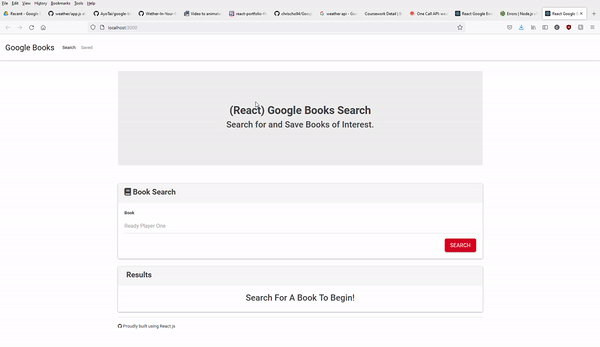

# Google Book Search 

  ## Description 
  An application that allows the user to search for a book and store the book.

  ## Table of Contents
  * [Installation](#installation)
  * [Usage](#usage)
  * [License](#license)
  * 
  ## Installation
  npm i, npm run start

  ## Usage 
  Book Search

  ## License
  This product uses a MIT license

  ## Demo
  

  ## Questions
  For additional questions feel free to contact: chrischo2012@gmail.com
  GitHub: https://github.com/chrischo94
  